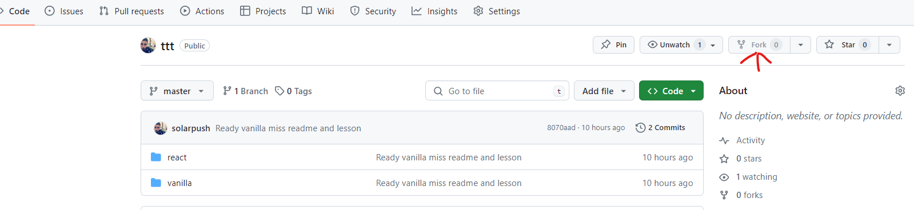

# Tic Tac Toe

Pour ce cours sur React js nous allons creer un petit jeu from scratch.


## Les objectifs du cours

- Comprendre les différences et les apports de react en terme de redondance.
- Maitriser les concepts simple de programmation (js, array, while, variables).
- Comporendre le JSX et ce qu'il remplace, ce qui est appeler quand le jsx est transpiler.

## Exercice

Dans le repository, deux dossiers sont présents:

- vanilla
- react

Dans le dossier vanilla un Tic Tac Toe est déjà présent.
Le but est de recoder les fonctionnalitées mais en utilisant react.

### Les règles

Bien sûr on pourait faire copier coller cela marcherait.

#### Interdits

- Il est interdit d'intéragir directement avec le DOM (pas d'accès à document.XXX)
- Pas d'ajout d'évènement avec addEventListener

#### Obligations

- Doit être composer d'au moins 3 Composants React(L'App, la grille, l'élément de la grille).
- Les éléments de la grille doivent être rendu à partir d'un tableau ou d'une boucle de manière programmatique.

## Mise en place

1. Faire un fork de ce dépot.

    

2. Cloné votre fork (important pour la PR de fin de journée)

    ```powershell
    # Clone your fork 
    git clone https://github.com/YOUR_GIT_TAG/ttt.git

    ```

3. Installer les deps.

    ```powershell

    cd ttt
    # run customScript install for install all deps in 2 subfolder
    npm run install 

    ```

## Ressources

[Babel playground JSX](https://babeljs.io/repl#?browsers=defaults%2C%20not%20ie%2011%2C%20not%20ie_mob%2011&build=&builtIns=false&corejs=3.21&spec=false&loose=false&code_lz=FAehAIGcEMDtPAW2gKwK6QMZoDYFNhMB7eAF3EwAsBLHAEwCc9ZwBecACgEo2A-cAN7Bw4JqTQMWHYeAA8AB17MAZnHJ004edAbQA5rvmU8skIpldgAX0IlI5AMI16TFu259BMsRKkyFSrCqsOqa2roG0EYmZrwW1rZk4ACC8vJsnDys_EIiYgxofiIisnTUAG5xxcUqauAy1aUVvJB4xLB04LAVeNBopmWVDcWyTrSMzOAgVdXFAiAAVFTjrlBwCMjoWLh44KrUCAwAl8pHrpi7AAfgONAUTNCk1CTgdADkheB4-IjM5ACOaGoXwAHqRmHQEHQ8AhvnhfiEEABIJHtWCaDSvIiIUEALnAACJ5ATwAAaQmDAnkgmtTBPEhUr6kTAAOhZCxANlmcmWLkm02GImGA2a8SsQA&debug=false&forceAllTransforms=false&modules=false&shippedProposals=false&circleciRepo=&evaluate=false&fileSize=false&timeTravel=false&sourceType=script&lineWrap=true&presets=env%2Creact%2Cstage-2&prettier=false&targets=&version=7.24.4&externalPlugins=&assumptions=%7B%7D)
